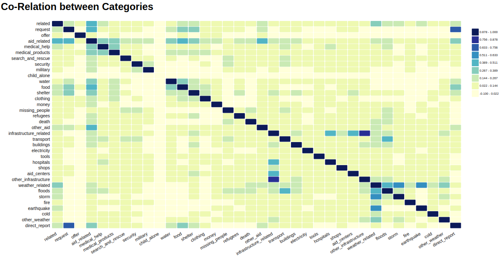

# Heat_Map
Interactive Heat Map


## Table of Contents
<ol>
   <li><a href="#head1"> Description of the project</a>
   <li><a href="#head2"> Libraries used </a>
   <li><a href="#head3"> Directory structure </a>
   <li><a href="#head4"> Usage </a>
   <li><a href="#head5"> Author </a>
</ol>


<h2 id="head1"> Description of the project </h2>
Given 2D array with first row and first column as category names and rest of the values being the corelation between the categories, create an interactive heat map.

<h2 id="head2"> Libraries used </h2>

<ul>
 <li> d3.js
</ul>

<h2 id="head3"> Directory structure </h2>

```
.
├── data                                                    # Folder to hold data files
    ├── data.csv                                            # Data in CSV format
    ├── data.js                                             # Data in JSON format
├── js                                                      # Folder to hold JS files
    ├── d3-v4.js                                            # d3 v4 file
    ├── HeatMap.js                                          # Main JS code for heat map creation
├── index.html                                              # Index HTML file
├── README.md                                               # ReadMe file

```

<h2 id="head4"> Usage </h2>

In the HTML page:
1. Include d3.js file
2. Include HeatMap.js file
3. Invoke the HeatMap method, passing in the d3 selection of div element to hold the chart, data array, title, and format.

Below is sample invocation and corresponding chart.

```
HeatMap({'divElement': d3.select('#chart'), 
						'dataArr':data, 
						'title':"Co-Relation between Categories",
						'format':"float3"
						});
```



<h2 id="head5"> Author </h2>

[Shahzeb Akhtar](https://www.linkedin.com/in/shahzebakhtar/)
